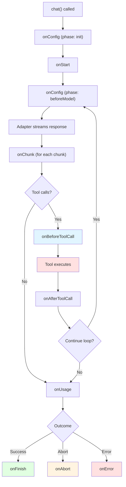

Middleware lets you hook into every stage of the `chat()` lifecycle — from configuration to streaming, tool execution, usage tracking, and completion. You can observe, transform, or short-circuit behavior at each stage without modifying your adapter or tool implementations.

Common use cases include:

- **Logging and observability** — track token usage, tool execution timing, errors
- **Configuration transforms** — inject system prompts, adjust temperature per iteration, filter tools
- **Stream processing** — redact sensitive content, transform chunks, drop unwanted events
- **Tool call interception** — validate arguments, cache results, abort on dangerous calls
- **Side effects** — send analytics, update databases, trigger notifications

## Quick Start

Pass an array of middleware to the `chat()` function:

```typescript
import { chat, type ChatMiddleware } from "@tanstack/ai";
import { openaiText } from "@tanstack/ai-openai";

const logger: ChatMiddleware = {
  name: "logger",
  onStart: (ctx) => {
    console.log(`[${ctx.requestId}] Chat started`);
  },
  onFinish: (ctx, info) => {
    console.log(`[${ctx.requestId}] Finished in ${info.duration}ms`);
  },
};

const stream = chat({
  adapter: openaiText("gpt-4o"),
  messages: [{ role: "user", content: "Hello" }],
  middleware: [logger],
});
```

## Lifecycle Overview

Every `chat()` invocation follows a predictable lifecycle. Middleware hooks fire at specific phases:



### Phase Transitions

The context's `phase` field tracks where you are in the lifecycle:

| Phase | When | Hooks Called |
|-------|------|-------------|
| `init` | Once at startup | `onConfig` |
| `beforeModel` | Before each model call (per iteration) | `onConfig` |
| `modelStream` | While adapter streams chunks | `onChunk`, `onUsage` |
| `beforeTools` | Before tool execution | `onBeforeToolCall` |
| `afterTools` | After tool execution | `onAfterToolCall` |

## Hooks Reference

### onConfig

Called twice per iteration: once during `init` (startup) and once during `beforeModel` (before each model call). Use it to transform the configuration that the model receives.

Return a **partial** config object with only the fields you want to change — they are shallow-merged with the current config automatically. No need to spread the existing config.

```typescript
const dynamicTemperature: ChatMiddleware = {
  name: "dynamic-temperature",
  onConfig: (ctx, config) => {
    if (ctx.phase === "init") {
      // Add a system prompt at startup — only systemPrompts is overwritten
      return {
        systemPrompts: [
          ...config.systemPrompts,
          "You are a helpful assistant.",
        ],
      };
    }

    if (ctx.phase === "beforeModel" && ctx.iteration > 0) {
      // Increase temperature on retries — other fields stay unchanged
      return {
        temperature: Math.min((config.temperature ?? 0.7) + 0.1, 1.0),
      };
    }
  },
};
```

**Config fields you can transform:**

| Field | Type | Description |
|-------|------|-------------|
| `messages` | `ModelMessage[]` | Conversation history |
| `systemPrompts` | `string[]` | System prompts |
| `tools` | `Tool[]` | Available tools |
| `temperature` | `number` | Sampling temperature |
| `topP` | `number` | Nucleus sampling |
| `maxTokens` | `number` | Token limit |
| `metadata` | `Record<string, unknown>` | Request metadata |
| `modelOptions` | `Record<string, unknown>` | Provider-specific options |

When multiple middleware define `onConfig`, the config is **piped** through them in order — each receives the merged config from the previous middleware.

### onStart

Called once after the initial `onConfig` completes. Use it for setup tasks like initializing timers or logging.

```typescript
const timer: ChatMiddleware = {
  name: "timer",
  onStart: (ctx) => {
    console.log(`Request ${ctx.requestId} started at iteration ${ctx.iteration}`);
  },
};
```

### onChunk

Called for every chunk streamed from the adapter. You can observe, transform, expand, or drop chunks.

```typescript
const redactor: ChatMiddleware = {
  name: "redactor",
  onChunk: (ctx, chunk) => {
    if (chunk.type === "TEXT_MESSAGE_CONTENT") {
      // Transform: redact sensitive content
      return {
        ...chunk,
        delta: chunk.delta.replace(/\b\d{3}-\d{2}-\d{4}\b/g, "[REDACTED]"),
      };
    }
    // Return void to pass through unchanged
  },
};
```

**Return values:**

| Return | Effect |
|--------|--------|
| `void` / `undefined` | Chunk passes through unchanged |
| `StreamChunk` | Replaces the original chunk |
| `StreamChunk[]` | Expands into multiple chunks |
| `null` | Drops the chunk entirely |

When multiple middleware define `onChunk`, chunks flow through them in order. If one middleware drops a chunk (returns `null`), subsequent middleware never see it.

### onBeforeToolCall

Called before each tool executes. The first middleware that returns a non-void decision short-circuits — remaining middleware are skipped for that tool call.

```typescript
const guard: ChatMiddleware = {
  name: "guard",
  onBeforeToolCall: (ctx, hookCtx) => {
    // Block dangerous tools
    if (hookCtx.toolName === "deleteDatabase") {
      return { type: "abort", reason: "Dangerous operation blocked" };
    }

    // Validate and transform arguments
    if (hookCtx.toolName === "search" && !hookCtx.args.limit) {
      return {
        type: "transformArgs",
        args: { ...hookCtx.args, limit: 10 },
      };
    }
  },
};
```

**Decision types:**

| Decision | Effect |
|----------|--------|
| `void` / `undefined` | Continue normally, next middleware can decide |
| `{ type: 'transformArgs', args }` | Replace tool arguments before execution |
| `{ type: 'skip', result }` | Skip execution entirely, use provided result |
| `{ type: 'abort', reason? }` | Abort the entire chat run |

The `hookCtx` provides:

| Field | Type | Description |
|-------|------|-------------|
| `toolCall` | `ToolCall` | Raw tool call object |
| `tool` | `Tool \| undefined` | Resolved tool definition |
| `args` | `unknown` | Parsed arguments |
| `toolName` | `string` | Tool name |
| `toolCallId` | `string` | Tool call ID |

### onAfterToolCall

Called after each tool execution (or skip). All middleware run — there is no short-circuiting.

```typescript
const toolLogger: ChatMiddleware = {
  name: "tool-logger",
  onAfterToolCall: (ctx, info) => {
    if (info.ok) {
      console.log(`${info.toolName} completed in ${info.duration}ms`);
    } else {
      console.error(`${info.toolName} failed:`, info.error);
    }
  },
};
```

The `info` object provides:

| Field | Type | Description |
|-------|------|-------------|
| `toolCall` | `ToolCall` | Raw tool call object |
| `tool` | `Tool \| undefined` | Resolved tool definition |
| `toolName` | `string` | Tool name |
| `toolCallId` | `string` | Tool call ID |
| `ok` | `boolean` | Whether execution succeeded |
| `duration` | `number` | Execution time in milliseconds |
| `result` | `unknown` | Result (when `ok` is true) |
| `error` | `unknown` | Error (when `ok` is false) |

### onUsage

Called once per model iteration when the `RUN_FINISHED` chunk includes usage data. Receives the usage object directly.

```typescript
const usageTracker: ChatMiddleware = {
  name: "usage-tracker",
  onUsage: (ctx, usage) => {
    console.log(
      `Iteration ${ctx.iteration}: ${usage.totalTokens} tokens`
    );
  },
};
```

The `usage` object:

| Field | Type | Description |
|-------|------|-------------|
| `promptTokens` | `number` | Input tokens |
| `completionTokens` | `number` | Output tokens |
| `totalTokens` | `number` | Total tokens |

### Terminal Hooks: onFinish, onAbort, onError

Exactly **one** terminal hook fires per `chat()` invocation. They are mutually exclusive:

| Hook | When it fires |
|------|--------------|
| `onFinish` | Run completed normally |
| `onAbort` | Run was aborted (via `ctx.abort()`, an external `AbortSignal`, or a `{ type: 'abort' }` decision from `onBeforeToolCall`) |
| `onError` | An unhandled error occurred |

```typescript
const terminal: ChatMiddleware = {
  name: "terminal",
  onFinish: (ctx, info) => {
    console.log(`Finished: ${info.finishReason}, ${info.duration}ms`);
    console.log(`Content: ${info.content}`);
    if (info.usage) {
      console.log(`Tokens: ${info.usage.totalTokens}`);
    }
  },
  onAbort: (ctx, info) => {
    console.log(`Aborted: ${info.reason}, ${info.duration}ms`);
  },
  onError: (ctx, info) => {
    console.error(`Error after ${info.duration}ms:`, info.error);
  },
};
```

## Context Object

Every hook receives a `ChatMiddlewareContext` as its first argument. It provides request-scoped information and control functions:

| Field | Type | Description |
|-------|------|-------------|
| `requestId` | `string` | Unique ID for this chat request |
| `streamId` | `string` | Unique ID for this stream |
| `conversationId` | `string \| undefined` | User-provided conversation ID |
| `phase` | `ChatMiddlewarePhase` | Current lifecycle phase |
| `iteration` | `number` | Agent loop iteration (0-indexed) |
| `chunkIndex` | `number` | Running count of chunks yielded |
| `signal` | `AbortSignal \| undefined` | External abort signal |
| `abort(reason?)` | `function` | Abort the run from within middleware |
| `context` | `unknown` | User-provided context value |
| `defer(promise)` | `function` | Register a non-blocking side-effect |

### Aborting from Middleware

Call `ctx.abort()` to gracefully stop the run. This triggers the `onAbort` terminal hook:

```typescript
const timeout: ChatMiddleware = {
  name: "timeout",
  onChunk: (ctx) => {
    if (ctx.chunkIndex > 1000) {
      ctx.abort("Too many chunks");
    }
  },
};
```

### Deferred Side Effects

Use `ctx.defer()` to register promises that run after the terminal hook without blocking the stream:

```typescript
const analytics: ChatMiddleware = {
  name: "analytics",
  onFinish: (ctx, info) => {
    ctx.defer(
      fetch("/api/analytics", {
        method: "POST",
        body: JSON.stringify({
          requestId: ctx.requestId,
          duration: info.duration,
          tokens: info.usage?.totalTokens,
        }),
      })
    );
  },
};
```

## Composing Multiple Middleware

Middleware execute in array order. The ordering matters for hooks that pipe or short-circuit:

```typescript
const stream = chat({
  adapter: openaiText("gpt-4o"),
  messages,
  middleware: [authMiddleware, loggingMiddleware, cachingMiddleware],
});
```

### Composition Rules

| Hook | Composition | Effect of Order |
|------|------------|----------------|
| `onConfig` | **Piped** — each receives previous output | Earlier middleware transforms first |
| `onStart` | Sequential | All run in order |
| `onChunk` | **Piped** — chunks flow through each middleware | If first drops a chunk, later middleware never see it |
| `onBeforeToolCall` | **First-win** — first non-void decision wins | Earlier middleware has priority |
| `onAfterToolCall` | Sequential | All run in order |
| `onUsage` | Sequential | All run in order |
| `onFinish/onAbort/onError` | Sequential | All run in order |

## Built-in Middleware

### toolCacheMiddleware

Caches tool call results based on tool name and arguments. When a tool is called with the same name and arguments as a previous call, the cached result is returned immediately without re-executing the tool.

```typescript
import { chat, toolCacheMiddleware } from "@tanstack/ai";

const stream = chat({
  adapter: openaiText("gpt-4o"),
  messages,
  tools: [weatherTool, stockTool],
  middleware: [
    toolCacheMiddleware({
      ttl: 60_000, // Cache entries expire after 60 seconds
      maxSize: 50, // Keep at most 50 entries (LRU eviction)
      toolNames: ["getWeather"], // Only cache specific tools
    }),
  ],
});
```

**Options:**

| Option | Type | Default | Description |
|--------|------|---------|-------------|
| `maxSize` | `number` | `100` | Maximum cache entries. Oldest evicted first (LRU). Only applies to the default in-memory storage. |
| `ttl` | `number` | `Infinity` | Time-to-live in milliseconds. Expired entries are not served. |
| `toolNames` | `string[]` | All tools | Only cache these tools. Others pass through. |
| `keyFn` | `(toolName, args) => string` | `JSON.stringify([toolName, args])` | Custom cache key derivation. |
| `storage` | `ToolCacheStorage` | In-memory Map | Custom storage backend. When provided, `maxSize` is ignored — the storage manages its own capacity. |

**Behaviors:**

- Only successful tool calls are cached — errors are never stored
- Cache hits trigger `{ type: 'skip', result }` via `onBeforeToolCall`
- LRU eviction: when `maxSize` is reached, the oldest entry is removed (default storage only)
- Cache hits refresh the entry's LRU position (moved to most-recently-used)

**Custom key function** — useful when you want to ignore certain arguments:

```typescript
toolCacheMiddleware({
  keyFn: (toolName, args) => {
    // Ignore pagination, cache by query only
    const { page, ...rest } = args as Record<string, unknown>;
    return JSON.stringify([toolName, rest]);
  },
});
```

#### Custom Storage

By default the cache lives in-memory and is scoped to a single `toolCacheMiddleware()` instance. Pass a `storage` option to use an external backend like Redis, localStorage, or a database. This also enables **sharing a cache across multiple `chat()` calls**.

The storage interface:

```typescript
import type { ToolCacheStorage, ToolCacheEntry } from "@tanstack/ai";

interface ToolCacheStorage {
  getItem: (key: string) => ToolCacheEntry | undefined | Promise<ToolCacheEntry | undefined>;
  setItem: (key: string, value: ToolCacheEntry) => void | Promise<void>;
  deleteItem: (key: string) => void | Promise<void>;
}

// ToolCacheEntry is { result: unknown, timestamp: number }
```

All methods may return a `Promise` for async backends. The middleware handles TTL checking — your storage just needs to store and retrieve entries.

**Redis example:**

```typescript
import { createClient } from "redis";
import { toolCacheMiddleware, type ToolCacheStorage } from "@tanstack/ai";

const redis = createClient();

const redisStorage: ToolCacheStorage = {
  getItem: async (key) => {
    const raw = await redis.get(`tool-cache:${key}`);
    return raw ? JSON.parse(raw) : undefined;
  },
  setItem: async (key, value) => {
    await redis.set(`tool-cache:${key}`, JSON.stringify(value));
  },
  deleteItem: async (key) => {
    await redis.del(`tool-cache:${key}`);
  },
};

const stream = chat({
  adapter,
  messages,
  tools: [weatherTool],
  middleware: [toolCacheMiddleware({ storage: redisStorage, ttl: 60_000 })],
});
```

**Sharing a cache across requests:**

```typescript
// Create storage once, reuse across chat() calls
const sharedStorage: ToolCacheStorage = {
  getItem: (key) => globalCache.get(key),
  setItem: (key, value) => { globalCache.set(key, value); },
  deleteItem: (key) => { globalCache.delete(key); },
};

// Both requests share the same cache
app.post("/api/chat", async (req) => {
  const stream = chat({
    adapter,
    messages: req.body.messages,
    tools: [weatherTool],
    middleware: [toolCacheMiddleware({ storage: sharedStorage })],
  });
  return toServerSentEventsResponse(stream);
});
```

## Recipes

### Rate Limiting

Limit the number of tool calls per request:

```typescript
function rateLimitMiddleware(maxCalls: number): ChatMiddleware {
  let toolCallCount = 0;
  return {
    name: "rate-limit",
    onBeforeToolCall: (ctx, hookCtx) => {
      toolCallCount++;
      if (toolCallCount > maxCalls) {
        return {
          type: "abort",
          reason: `Rate limit: exceeded ${maxCalls} tool calls`,
        };
      }
    },
  };
}
```

### Audit Trail

Log every action for compliance:

```typescript
const auditTrail: ChatMiddleware = {
  name: "audit-trail",
  onStart: (ctx) => {
    ctx.defer(
      db.auditLog.create({
        requestId: ctx.requestId,
        event: "chat_started",
        timestamp: Date.now(),
      })
    );
  },
  onAfterToolCall: (ctx, info) => {
    ctx.defer(
      db.auditLog.create({
        requestId: ctx.requestId,
        event: "tool_executed",
        toolName: info.toolName,
        success: info.ok,
        duration: info.duration,
        timestamp: Date.now(),
      })
    );
  },
  onFinish: (ctx, info) => {
    ctx.defer(
      db.auditLog.create({
        requestId: ctx.requestId,
        event: "chat_finished",
        duration: info.duration,
        tokens: info.usage?.totalTokens,
        timestamp: Date.now(),
      })
    );
  },
};
```

### Per-Iteration Tool Swapping

Expose different tools at different stages of the agent loop:

```typescript
const toolSwapper: ChatMiddleware = {
  name: "tool-swapper",
  onConfig: (ctx, config) => {
    if (ctx.phase !== "beforeModel") return;

    if (ctx.iteration === 0) {
      // First iteration: only allow search
      return {
        tools: config.tools.filter((t) => t.name === "search"),
      };
    }
    // Later iterations: allow all tools
  },
};
```

### Content Filtering

Drop or transform chunks before they reach the consumer:

```typescript
const contentFilter: ChatMiddleware = {
  name: "content-filter",
  onChunk: (ctx, chunk) => {
    if (chunk.type === "TEXT_MESSAGE_CONTENT") {
      if (containsProfanity(chunk.delta)) {
        // Drop the chunk entirely
        return null;
      }
    }
  },
};
```

### Error Recovery with Retry Logging

```typescript
const errorRecovery: ChatMiddleware = {
  name: "error-recovery",
  onError: (ctx, info) => {
    ctx.defer(
      alertService.send({
        level: "error",
        message: `Chat ${ctx.requestId} failed after ${info.duration}ms`,
        error: String(info.error),
      })
    );
  },
};
```

## TypeScript Types

All middleware types are exported from `@tanstack/ai`:

```typescript
import type {
  ChatMiddleware,
  ChatMiddlewareContext,
  ChatMiddlewarePhase,
  ChatMiddlewareConfig,
  ToolCallHookContext,
  BeforeToolCallDecision,
  AfterToolCallInfo,
  UsageInfo,
  FinishInfo,
  AbortInfo,
  ErrorInfo,
  ToolCacheMiddlewareOptions,
  ToolCacheStorage,
  ToolCacheEntry,
} from "@tanstack/ai";
```

## Next Steps

- [Tools](./tools) — Learn about the isomorphic tool system
- [Agentic Cycle](./agentic-cycle) — Understand the multi-step agent loop
- [Observability](./observability) — Event-driven observability with the event client
- [Streaming](./streaming) — How streaming works in TanStack AI
