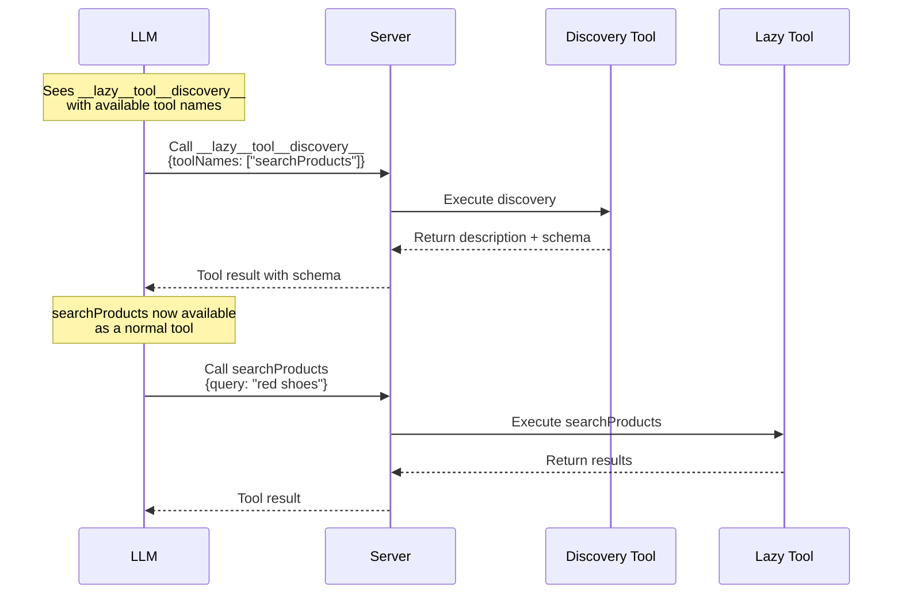

When an application has many tools, sending all tool definitions to the LLM on every request wastes tokens and can degrade response quality. Lazy tool discovery lets the LLM selectively discover only the tools it needs for the current task.

## How It Works

Tools marked with `lazy: true` are **not** sent to the LLM upfront. Instead, a synthetic `__lazy__tool__discovery__` tool is created whose description lists all available lazy tool names. The LLM can call this discovery tool with the names of tools it wants to learn about, and receives their full descriptions and argument schemas in return.

Once discovered, lazy tools are dynamically injected as normal tools — the LLM calls them directly like any other tool.



## Marking Tools as Lazy

Add `lazy: true` to any tool definition:

```typescript
import { toolDefinition } from "@tanstack/ai";
import { z } from "zod";

const searchProductsDef = toolDefinition({
  name: "searchProducts",
  description: "Search products by keyword in name or description",
  inputSchema: z.object({
    query: z.string().describe("Search keyword or phrase"),
  }),
  outputSchema: z.object({
    results: z.array(
      z.object({
        id: z.number(),
        name: z.string(),
        price: z.number(),
      })
    ),
  }),
  lazy: true, // This tool won't be sent to the LLM upfront
});

const searchProducts = searchProductsDef.server(async ({ query }) => {
  const results = await db.products.search(query);
  return { results };
});
```

Then pass it to `chat()` alongside your other tools:

```typescript
import { chat, toServerSentEventsResponse } from "@tanstack/ai";
import { openaiText } from "@tanstack/ai-openai";

const stream = chat({
  adapter: openaiText("gpt-4o"),
  messages,
  tools: [
    getProducts, // Normal tool — sent to LLM immediately
    searchProducts, // Lazy tool — discovered on demand
    compareProducts, // Lazy tool — discovered on demand
  ],
});

return toServerSentEventsResponse(stream);
```

## When to Use Lazy Tools

Lazy tools are useful when:

- **You have many tools** and want to reduce token usage per request
- **Some tools are rarely needed** — secondary features like comparison, financing, or advanced search
- **Tool descriptions are large** — lazy tools keep the initial prompt lean

Tools that are called in most conversations should remain eager (the default).

## Discovery Flow

1. The LLM sees `__lazy__tool__discovery__` with a list of available tool names in its description
2. Based on the user's request, the LLM decides which tools it needs and calls the discovery tool
3. The discovery tool returns the full description and JSON Schema for each requested tool
4. The discovered tools are injected as normal tools for the next iteration
5. The LLM calls the discovered tools directly

The LLM can discover one or many tools in a single call:

```
// LLM calls:
__lazy__tool__discovery__({ toolNames: ["searchProducts", "compareProducts"] })
```

## Multi-Turn Conversations

Lazy tool discovery works across multiple turns. When a tool is discovered in one turn, it remains available in subsequent turns within the same conversation — the LLM does not need to re-discover it.

This is handled automatically by scanning the message history for previous discovery tool results on each `chat()` call.

## Self-Correction

If the LLM tries to call a lazy tool that hasn't been discovered yet, it receives an error message:

```
Error: Tool 'searchProducts' must be discovered first.
Call __lazy__tool__discovery__ with toolNames: ['searchProducts'] to discover it.
```

The LLM then self-corrects by calling the discovery tool first, then retrying the original tool call.

## Zero Overhead

If none of your tools have `lazy: true`, no discovery tool is created and the behavior is identical to the default. There is no performance or token cost when lazy discovery is not in use.

When all lazy tools have been discovered, the discovery tool is automatically removed from the active tool set.

## Example

Here's a complete example with a mix of eager and lazy tools:

```typescript
import { toolDefinition, chat, toServerSentEventsResponse, maxIterations } from "@tanstack/ai";
import { openaiText } from "@tanstack/ai-openai";
import { z } from "zod";

// Eager tool — always available
const getProductsDef = toolDefinition({
  name: "getProducts",
  description: "Get all products from the catalog",
  inputSchema: z.object({}),
  outputSchema: z.array(
    z.object({
      id: z.number(),
      name: z.string(),
      price: z.number(),
    })
  ),
});

const getProducts = getProductsDef.server(async () => {
  return await db.products.findMany();
});

// Lazy tool — discovered on demand
const compareProductsDef = toolDefinition({
  name: "compareProducts",
  description: "Compare two or more products side by side",
  inputSchema: z.object({
    productIds: z.array(z.number()).min(2),
  }),
  lazy: true,
});

const compareProducts = compareProductsDef.server(async ({ productIds }) => {
  const products = await db.products.findMany({
    where: { id: { in: productIds } },
  });
  return { products };
});

// Lazy tool — discovered on demand
const calculateFinancingDef = toolDefinition({
  name: "calculateFinancing",
  description: "Calculate monthly payment plans for a product",
  inputSchema: z.object({
    productId: z.number(),
    months: z.number(),
  }),
  lazy: true,
});

const calculateFinancing = calculateFinancingDef.server(async ({ productId, months }) => {
  const product = await db.products.findUnique({ where: { id: productId } });
  const monthlyPayment = product.price / months;
  return { monthlyPayment, totalPrice: product.price, months };
});

// Use in chat
export async function POST(request: Request) {
  const { messages } = await request.json();

  const stream = chat({
    adapter: openaiText("gpt-4o"),
    messages,
    tools: [getProducts, compareProducts, calculateFinancing],
    agentLoopStrategy: maxIterations(20),
  });

  return toServerSentEventsResponse(stream);
}
```

With this setup:
- The LLM always sees `getProducts` and `__lazy__tool__discovery__`
- When a user asks to compare products, the LLM discovers `compareProducts` first, then calls it
- When a user asks about financing, the LLM discovers `calculateFinancing` first, then calls it

## Next Steps

- [Tools Overview](./tools) - Basic tool concepts
- [Server Tools](./server-tools) - Server-side tool execution
- [Tool Architecture](./tool-architecture) - Deep dive into the tool system
- [Agentic Cycle](../chat/agentic-cycle) - How the agent loop works
